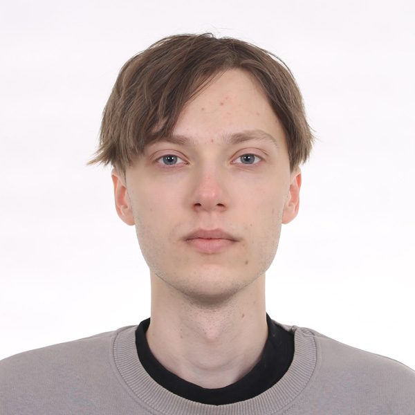

# Oleksandr Alonkin, 21 

**Telegram**: [@Alionkin](https://t.me/Alionkin)  
**Email**: alionalexxx@gmail.com  

---

## 🎯 Goal
I aim to develop a data compression algorithm that could have a global impact. Ok, seriously at the moment my priority is to study and get my first professional experience in IT. I've worked in various fields in the past—musician, bookkeeper's assistant, magician's assistant, and event operator—but programming has brought me the most satisfaction. My dedication to learning comes from discipline, not motivation; I am passionate about continuous growth and cannot imagine life without it.

---

## 💻 Skills
- **Basic Hypercodes**: HTML, CSS, SCSS
- **Programming Languages**: JavaScript, TypeScript
- **Frameworks**: React (DOM manipulation, API integration)
- **Version Control**: Git (GitHub, GitLab)
- **Development Tools**: Visual Studio Code, Figma
- **Databases**: SQL (MySQL, PostgreSQL)
- **Development Methodologies**: Agile, Scrum (basics)
- **Algorithms and Data Structures**: Arrays, Lists, Stacks, Basic Sorting Algorithms
- **REST API Principles**: Fundamentals of working with HTTP requests

---

## 🛠 Experience
- **HTML/CSS Landing Page**  
  GitHub: [nevox-alexxx.github.io](https://github.com/nevox-alexxx/nevox-alexxx.github.io)  
  Live: [nevox-alexxx.github.io](https://nevox-alexxx.github.io/)
  
- **React Quiz App**  
  GitHub: [quiz-react-project](https://github.com/nevox-alexxx/quiz-react-project)  
  Live: [Quiz React Project](https://quiz-react-project-ea6nvpd16-nevox-alexxxs-projects.vercel.app/)

- **React TypeScript Pomodoro Timer** (PWA, in progress)  
  GitHub: [pomo-timer](https://github.com/nevox-alexxx/pomo-timer) 
---

## 🎓 Education
- **High School**  
- **University**: 4th-year student  
- **Programming**: 1 year of self-study + Completed Stage 1 of Binary Studio Academy 2024

---

## 🌎 Language
- **English**: B2 (Looking to improve through active practice, considering dedicated platforms)
- **International Experience**: Solo traveled in Poland, Finland, Lithuania, Latvia, Estonia, Thailand, Germany
